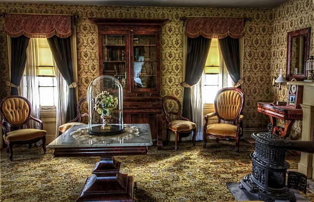
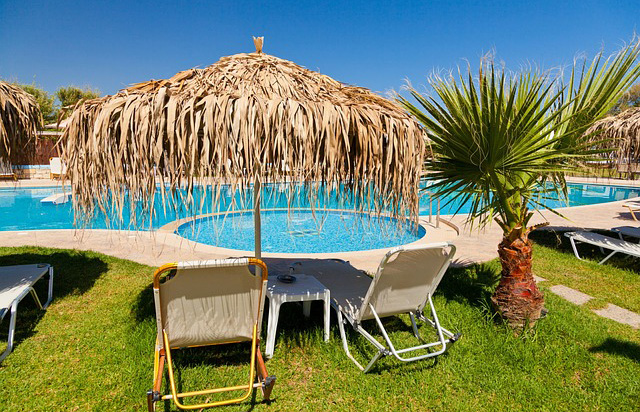
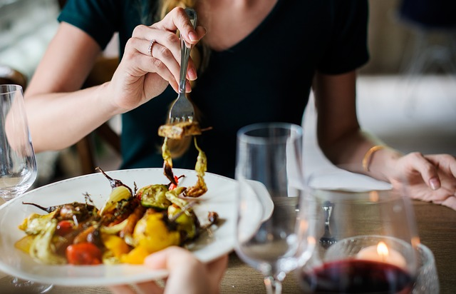

# Desenvolvimento Web Completo

## Professor Hamilton Damasceno

## Seção 12: Projeto Chalé Hotel - Hora de praticar  :pushpin::round_pushpin: 

### 95. projeto5 Chalé Hotel - Criando topo

#### Arquivo completo - index.html

```html
<!DOCTYPE html>
<html lang="pt-BR">
<head>
    <meta charset="UTF-8">
    <meta name="viewport" content="width=device-width, initial-scale=1.0">
    <title>Chalé Hotel</title>
    <link rel="stylesheet" href="./css/estilo.css">
</head>
<body>
    <!-- Início Container -->
    <div id="container">
        
        <!-- Início Topo -->
        <div id="topo">

            <div id="area-logo">
                <h1>
                    <a href="">Chalé Hotel</a>
                </h1>
            </div>

            <div id="area-menu">
                Menu
            </div>
        </div> <!-- Fim Topo -->

    </div> <!-- Fim Container -->
</body>
</html>
```


---

#### Arquivo completo - estilo.css

```css
* {
    margin: 0;
    padding: 0;
}

body {
    font-family: Arial, Helvetica, sans-serif;
    background: #fff url(../imagens/bg.png);
    margin: 15px;
}

#container {
    background: #ede9cc;
}

#topo {
    position: relative;
    background: #dbcd87;
    height: 15.4em;
    min-height: 250px;
}

#area-logo {
    background: url(../imagens/topo-imagem-principal.png) no-repeat;
    position: absolute;
    top: 0;
    left: 0;
    width: 100%;
    height: 250px;
}

#area-menu {
    background: url(../imagens/topo-imagem-lateral.png) no-repeat;
    position: absolute;
    top: 0;
    right: 0;
    width: 450px;
    height: 250px;
}
```


---

---


### 96. projeto5 Chalé Hotel - Ajustando topo

#### Arquivo completo - index.html

```html
<!DOCTYPE html>
<html lang="pt-BR">
<head>
    <meta charset="UTF-8">
    <meta name="viewport" content="width=device-width, initial-scale=1.0">
    <title>Chalé Hotel</title>
    <link rel="stylesheet" href="./css/estilo.css">
</head>
<body>
    <!-- Início Container -->
    <div id="container">
        
        <!-- Início Topo -->
        <div id="topo">

            <div id="area-logo">
                <h1 class="logo">
                    <a href="">Chalé Hotel</a>
                </h1>
            </div>

            <div id="area-menu">
                <div id="conteudo-menu">
                    <div id="menu-locais">
                        <span class="locais" >Rio de Janeiro - São Paulo - Belo Horizonte</span>
                        <a class="reserva" href="">Reservar</a>
                        <div style="clear: both;"></div>
                    </div>
                </div>
            </div>
        </div> <!-- Fim Topo -->

    </div> <!-- Fim Container -->
</body>
</html>
```


---

#### Arquivo completo - estilo.css

```css
* {
    margin: 0;
    padding: 0;
}

body {
    font-family: Arial, Helvetica, sans-serif;
    background: #fff url(../imagens/bg.png);
    margin: 15px;
}

#container {
    background: #ede9cc;
    margin: 0 auto;
    min-width: 740px;
    max-width: 1180px;
}

#topo {
    position: relative;
    background: #dbcd87;
    height: 15.4em;
    min-height: 250px;
}

#area-logo {
    background: url(../imagens/topo-imagem-principal.png) no-repeat;
    position: absolute;
    top: 0;
    left: 0;
    z-index: 1;
    width: 100%;
    height: 250px;
}

.logo a {
    position: absolute;
    top: 15px;
    left: 15px;
    z-index: 3;
    background: url(../imagens/logo.png) no-repeat;
    width: 151px;
    height: 66px;
    text-indent: -9000px;
}

#area-menu {
    background: url(../imagens/topo-imagem-lateral.png) no-repeat;
    position: absolute;
    top: 0;
    right: 0;
    z-index: 2;
    width: 450px;
    height: 250px;
}

#conteudo-menu {
    margin-left: 90px;
    margin-right: 15px;
    padding-top: 15px;
}

#menu-locais {
    border-top: 1px solid #b5ab56;
    border-bottom: 1px solid #b5ab56;
    padding-top: 5px;
    padding-bottom: 5px;
    font-size: 0.7em;
    color: #8b8448;
}

#menu-locais .locais {
    float: left;
    line-height: 2.1em;
}

a {
    text-decoration: none;
}

a.reserva {
    text-transform: uppercase;
    background: #a29750;
    color: #fff5b0;
    padding: 5px 10px;
    float: right;
}
```


---

---


### 97. projeto5 Chalé Hotel - Criando menu vertical

#### Arquivo completo - index.html

```html
<!DOCTYPE html>
<html lang="pt-BR">
<head>
    <meta charset="UTF-8">
    <meta name="viewport" content="width=device-width, initial-scale=1.0">
    <title>Chalé Hotel</title>
    <link rel="stylesheet" href="./css/estilo.css">
</head>
<body>
    <!-- Início Container -->
    <div id="container">
        
        <!-- Início Topo -->
        <div id="topo">

            <!-- Início area-logo -->
            <div id="area-logo">
                <h1 class="logo">
                    <a href="">Chalé Hotel</a>
                </h1>
            </div> <!-- Fim area-logo -->

            <!-- Início area-menu -->
            <div id="area-menu">

                <!-- Início conteudo-menu -->
                <div id="conteudo-menu">

                    <!-- Início menu-locais -->
                    <div id="menu-locais">
                        <span class="locais" >Rio de Janeiro - São Paulo - Belo Horizonte</span>
                        <a class="reserva" href="">Reservar</a>
                        <div style="clear: both;"></div>
                    </div> <!-- Fim menu-locais -->

                    <!-- Início menu -->
                    <div id="menu">
                        <ul id="navegacao">
                            <li><a href="">Home</a></li>
                            <li><a href="">História</a></li>
                            <li><a href="">Imprensa</a></li>
                            <li><a href="">Gastronomia</a></li>
                            <li><a href="">Contato</a></li>
                        </ul>

                        
                    </div><!-- Fim menu -->

                </div> <!-- Fim conteudo-menu -->

            </div> <!-- Fim area-menu -->

        </div> <!-- Fim Topo -->

    </div> <!-- Fim Container -->
</body>
</html>
```


---

#### Arquivo completo - estilo.css

```css
* {
    margin: 0;
    padding: 0;
}

body {
    font-family: Arial, Helvetica, sans-serif;
    background: #fff url(../imagens/bg.png);
    margin: 15px;
}

#container {
    background: #ede9cc;
    margin: 0 auto;
    min-width: 740px;
    max-width: 1180px;
}

#topo {
    position: relative;
    background: #dbcd87;
    height: 15.4em;
    min-height: 250px;
}

#area-logo {
    background: url(../imagens/topo-imagem-principal.png) no-repeat;
    position: absolute;
    top: 0;
    left: 0;
    z-index: 1;
    width: 100%;
    height: 250px;
}

.logo a {
    position: absolute;
    top: 15px;
    left: 15px;
    z-index: 3;
    background: url(../imagens/logo.png) no-repeat;
    width: 151px;
    height: 66px;
    text-indent: -9000px;
}

#area-menu {
    background: url(../imagens/topo-imagem-lateral.png) no-repeat;
    position: absolute;
    top: 0;
    right: 0;
    z-index: 2;
    width: 450px;
    height: 250px;
}

#conteudo-menu {
    margin-left: 90px;
    margin-right: 15px;
    padding-top: 15px;
}

#menu-locais {
    border-top: 1px solid #b5ab56;
    border-bottom: 1px solid #b5ab56;
    padding-top: 5px;
    padding-bottom: 5px;
    font-size: 0.7em;
    color: #8b8448;
}

#menu-locais .locais {
    float: left;
    line-height: 2.1em;
}

a {
    text-decoration: none;
}

a.reserva {
    text-transform: uppercase;
    background: #a29750;
    color: #fff5b0;
    padding: 5px 10px;
    float: right;
}

#menu {
    margin-top: 15px;
}

ul {
    list-style: none;
}

ul#navegacao {
    float: left;
}

ul#navegacao a {
    text-transform: uppercase;
    font-size: 0.8em;
    padding: 5px;
    color: #6e672c;
    line-height: 30px;
}

ul#navegacao a:hover {
    background: #fdf6be;
}

.depoimento {
    width: 226px;
    height: 164px;
    float: right;
}
```


---

---


### 98. projeto5 Chalé Hotel - Área de conteúdos

#### Arquivo completo - index.html

```html
<!DOCTYPE html>
<html lang="pt-BR">
<head>
    <meta charset="UTF-8">
    <meta name="viewport" content="width=device-width, initial-scale=1.0">
    <title>Chalé Hotel</title>
    <link rel="stylesheet" href="./css/estilo.css">
</head>
<body>
    <!-- Início Container -->
    <div id="container">
        
        <!-- Início Topo -->
        <div id="topo">

            <!-- Início area-logo -->
            <div id="area-logo">
                <h1 class="logo">
                    <a href="">Chalé Hotel</a>
                </h1>
            </div> <!-- Fim area-logo -->

            <!-- Início area-menu -->
            <div id="area-menu">

                <!-- Início conteudo-menu -->
                <div id="conteudo-menu">

                    <!-- Início menu-locais -->
                    <div id="menu-locais">
                        <span class="locais" >Rio de Janeiro - São Paulo - Belo Horizonte</span>
                        <a class="reserva" href="">Reservar</a>
                        <div style="clear: both;"></div>
                    </div> <!-- Fim menu-locais -->

                    <!-- Início menu -->
                    <div id="menu">
                        <ul id="navegacao">
                            <li><a href="">Home</a></li>
                            <li><a href="">História</a></li>
                            <li><a href="">Imprensa</a></li>
                            <li><a href="">Gastronomia</a></li>
                            <li><a href="">Contato</a></li>
                        </ul>

                        
                    </div><!-- Fim menu -->

                </div> <!-- Fim conteudo-menu -->

            </div> <!-- Fim area-menu -->

        </div> <!-- Fim Topo -->

        <!-- Início area-principal -->
        <div id="area-principal">
            <div class="conteudo">
                <h2>Lorem ipsum dolor sit</h2>
                <p>Lorem ipsum dolor sit amet consectetur adipisicing elit. Illo repellat at sit possimus architecto, sint soluta voluptatibus recusandae! Molestiae perferendis tempore consequuntur aliquam laboriosam iste sit enim possimus distinctio asperiores.</p>
                <p>Lorem ipsum dolor sit amet consectetur adipisicing elit. Illo repellat at sit possimus architecto, sint soluta voluptatibus recusandae! Molestiae perferendis tempore consequuntur aliquam laboriosam iste sit enim possimus distinctio asperiores.</p>
                <p>Lorem ipsum dolor sit amet consectetur adipisicing elit. Illo repellat at sit possimus architecto, sint soluta voluptatibus recusandae! Molestiae perferendis tempore consequuntur aliquam laboriosam iste sit enim possimus distinctio asperiores.</p>
            </div>
        </div><!-- Fim area-principal -->

        <!-- Início area-lateral -->
        <div id="area-lateral">
            <div class="conteudo">
                <p>Lorem, ipsum dolor sit amet consectetur adipisicing elit. Odio eos dolorum qui esse adipisci totam modi fugiat nesciunt sint architecto, necessitatibus consequuntur quasi autem et provident non sunt, sed reiciendis.</p>
            </div>
        </div><!-- Fim area-lateral -->

        <!-- Início rodape -->
        <div id="rodape">
            Rodape
        </div> <!-- Fim rodape -->

    </div> <!-- Fim Container -->
</body>
</html>
```


---

#### Arquivo completo - estilo.css

```css
* {
    margin: 0;
    padding: 0;
}

body {
    font-family: Arial, Helvetica, sans-serif;
    background: #fff url(../imagens/bg.png);
    margin: 15px;
}

#container {
    background: #ede9cc url(../imagens/bg-container.png) top center repeat-y;
    margin: 0 auto;
    min-width: 740px;
    max-width: 1180px;
}

#topo {
    position: relative;
    background: #dbcd87;
    height: 15.4em;
    min-height: 250px;
}

#area-logo {
    background: url(../imagens/topo-imagem-principal.png) no-repeat;
    position: absolute;
    top: 0;
    left: 0;
    z-index: 1;
    width: 100%;
    height: 250px;
}

.logo a {
    position: absolute;
    top: 15px;
    left: 15px;
    z-index: 3;
    background: url(../imagens/logo.png) no-repeat;
    width: 151px;
    height: 66px;
    text-indent: -9000px;
}

#area-menu {
    background: url(../imagens/topo-imagem-lateral.png) no-repeat;
    position: absolute;
    top: 0;
    right: 0;
    z-index: 2;
    width: 450px;
    height: 250px;
}

#conteudo-menu {
    margin-left: 90px;
    margin-right: 15px;
    padding-top: 15px;
}

#menu-locais {
    border-top: 1px solid #b5ab56;
    border-bottom: 1px solid #b5ab56;
    padding-top: 5px;
    padding-bottom: 5px;
    font-size: 0.7em;
    color: #8b8448;
}

#menu-locais .locais {
    float: left;
    line-height: 2.1em;
}

a {
    text-decoration: none;
}

a.reserva {
    text-transform: uppercase;
    background: #a29750;
    color: #fff5b0;
    padding: 5px 10px;
    float: right;
}

#menu {
    margin-top: 15px;
}

ul {
    list-style: none;
}

ul#navegacao {
    float: left;
}

ul#navegacao a {
    text-transform: uppercase;
    font-size: 0.8em;
    padding: 5px;
    color: #6e672c;
    line-height: 30px;
}

ul#navegacao a:hover {
    background: #fdf6be;
}

.depoimento {
    width: 226px;
    height: 164px;
    float: right;
}

/* Área de Conteúdos */

#area-principal {
    background: url(../imagens/bg-area-principal.png) top left repeat-x;
    float: left;
    width: 50%;
    padding: 15px 0;
}

#area-lateral {
    background: url(../imagens/bg-area-lateral.png) top left repeat-x;
    float: right;
    width: 50%;
    padding: 20px 0;
}

.conteudo {
    margin: 0 auto;
    width: 90%;
}

#rodape {
    clear: both;
}
```


---

---


### 99. projeto5 Chalé Hotel - Conteúdo lateral e rodapé

#### Arquivo completo - index.html

```html
<!DOCTYPE html>
<html lang="pt-BR">
<head>
    <meta charset="UTF-8">
    <meta name="viewport" content="width=device-width, initial-scale=1.0">
    <title>Chalé Hotel</title>
    <link rel="stylesheet" href="./css/estilo.css">
</head>
<body>
    <!-- Início Container -->
    <div id="container">
        
        <!-- Início Topo -->
        <div id="topo">

            <!-- Início area-logo -->
            <div id="area-logo">
                <h1 class="logo">
                    <a href="">Chalé Hotel</a>
                </h1>
            </div> <!-- Fim area-logo -->

            <!-- Início area-menu -->
            <div id="area-menu">

                <!-- Início conteudo-menu -->
                <div id="conteudo-menu">

                    <!-- Início menu-locais -->
                    <div id="menu-locais">
                        <span class="locais" >Rio de Janeiro - São Paulo - Belo Horizonte</span>
                        <a class="reserva" href="">Reservar</a>
                        <div style="clear: both;"></div>
                    </div> <!-- Fim menu-locais -->

                    <!-- Início menu -->
                    <div id="menu">
                        <ul id="navegacao">
                            <li><a href="">Home</a></li>
                            <li><a href="">História</a></li>
                            <li><a href="">Imprensa</a></li>
                            <li><a href="">Gastronomia</a></li>
                            <li><a href="">Contato</a></li>
                        </ul>

                        
                    </div><!-- Fim menu -->

                </div> <!-- Fim conteudo-menu -->

            </div> <!-- Fim area-menu -->

        </div> <!-- Fim Topo -->

        <!-- Início area-principal -->
        <div id="area-principal">
            <div class="conteudo">
                <h2>Lorem ipsum dolor sit</h2>
                <p>Lorem ipsum dolor sit amet consectetur adipisicing elit. Illo repellat at sit possimus architecto, sint soluta voluptatibus recusandae! Molestiae perferendis tempore consequuntur aliquam laboriosam iste sit enim possimus distinctio asperiores.</p>
                <p>Lorem ipsum dolor sit amet consectetur adipisicing elit. Illo repellat at sit possimus architecto, sint soluta voluptatibus recusandae! Molestiae perferendis tempore consequuntur aliquam laboriosam iste sit enim possimus distinctio asperiores.</p>
                <p>Lorem ipsum dolor sit amet consectetur adipisicing elit. Illo repellat at sit possimus architecto, sint soluta voluptatibus recusandae! Molestiae perferendis tempore consequuntur aliquam laboriosam iste sit enim possimus distinctio asperiores.</p>
            </div>
        </div><!-- Fim area-principal -->

        <!-- Início area-lateral -->
        <div id="area-lateral">
            <div class="conteudo">
                <ul id="beneficios">
                    <li>
                        <a href="">
                            
                            <h3>Apartamento</h3>
                            <p>
                                Lorem ipsum dolor sit amet consectetur adipisicing elit. Aliquam error quisquam hic ab quod natus, cum maxime et.
                            </p>
                        </a>
                    </li>
                     <li>
                        <a href="">
                            
                            <h3>Piscina</h3>
                            <p>
                                Lorem ipsum dolor sit amet consectetur adipisicing elit. Aliquam error quisquam hic ab quod natus, cum maxime et.
                            </p>
                        </a>
                    </li>
                     <li>
                        <a href="">
                            
                            <h3>Restaurante</h3>
                            <p>
                                Lorem ipsum dolor sit amet consectetur adipisicing elit. Aliquam error quisquam hic ab quod natus, cum maxime et.
                            </p>
                        </a>
                    </li>
                </ul>
            </div>
        </div><!-- Fim area-lateral -->

        <!-- Início rodape -->
        <div id="rodape">
            <span>&copy; Copyright 2000-2020 Chalé Hotel</span>
        </div> <!-- Fim rodape -->

    </div> <!-- Fim Container -->
</body>
</html>
```


---

#### Arquivo completo - estilo.css

```css
* {
    margin: 0;
    padding: 0;
}

body {
    font-family: Arial, Helvetica, sans-serif;
    background: #fff url(../imagens/bg.png);
    margin: 15px;
}

#container {
    background: #ede9cc url(../imagens/bg-container.png) top center repeat-y;
    margin: 0 auto;
    min-width: 740px;
    max-width: 1180px;
}

#topo {
    position: relative;
    background: #dbcd87;
    height: 15.4em;
    min-height: 250px;
}

#area-logo {
    background: url(../imagens/topo-imagem-principal.png) no-repeat;
    position: absolute;
    top: 0;
    left: 0;
    z-index: 1;
    width: 100%;
    height: 250px;
}

.logo a {
    position: absolute;
    top: 15px;
    left: 15px;
    z-index: 3;
    background: url(../imagens/logo.png) no-repeat;
    width: 151px;
    height: 66px;
    text-indent: -9000px;
}

#area-menu {
    background: url(../imagens/topo-imagem-lateral.png) no-repeat;
    position: absolute;
    top: 0;
    right: 0;
    z-index: 2;
    width: 450px;
    height: 250px;
}

#conteudo-menu {
    margin-left: 90px;
    margin-right: 15px;
    padding-top: 15px;
}

#menu-locais {
    border-top: 1px solid #b5ab56;
    border-bottom: 1px solid #b5ab56;
    padding-top: 5px;
    padding-bottom: 5px;
    font-size: 0.7em;
    color: #8b8448;
}

#menu-locais .locais {
    float: left;
    line-height: 2.1em;
}

a {
    text-decoration: none;
}

a.reserva {
    text-transform: uppercase;
    background: #a29750;
    color: #fff5b0;
    padding: 5px 10px;
    float: right;
}

#menu {
    margin-top: 15px;
}

ul {
    list-style: none;
}

ul#navegacao {
    float: left;
}

ul#navegacao a {
    text-transform: uppercase;
    font-size: 0.8em;
    padding: 5px;
    color: #6e672c;
    line-height: 30px;
}

ul#navegacao a:hover {
    background: #fdf6be;
}

.depoimento {
    width: 226px;
    height: 164px;
    float: right;
}

/* Área de Conteúdos */

#area-principal {
    background: url(../imagens/bg-area-principal.png) top left repeat-x;
    float: left;
    width: 50%;
    padding: 15px 0;
}

#area-lateral {
    background: url(../imagens/bg-area-lateral.png) top left repeat-x;
    float: right;
    width: 50%;
    padding: 20px 0;
}

.conteudo {
    margin: 0 auto;
    width: 90%;
}

#rodape {
    clear: both;
    padding: 16px;
    background: #fff url(../imagens/bg-rodape.png) repeat-x top;
    color: #7d7640;
}

/* Formatações de textos */
h2 {
    color: #7d7640;
    font-size: 1.1em;
    padding: 5px 0;
}

p {
    font-size: 1em;
    margin-bottom: 10px;
}

/* Formatações da area-lateral */
#beneficios li {
    padding: 8px;
    border-bottom: px solid #f3efcb;
    height: 6em;
}

#beneficios li a img {
    float: left;
    margin-right: 8px;
}

#beneficios li a p{
    color: #000;
    font-size: 0.8em;
}

#beneficios li a h3 {
    font-size: 1em;
    color: #615b2d;
    padding: 5px 0;
    background: url(../imagens/ornamento.png) no-repeat center right;
}

#beneficios li:hover {
    background: #f6f3d6;
    cursor: pointer;
}
```


---

---

