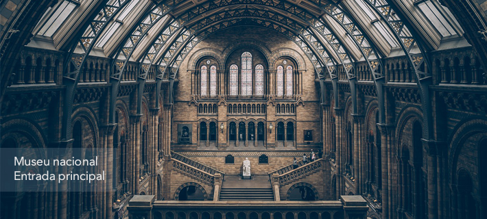
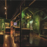

# Desenvolvimento Web Completo

## Professor Hamilton Damasceno

## Seção 13: Projeto Museu Nacional - Hora de praticar ​ 

### 100. projeto6 Museu Nacional - Criando topo

#### Arquivo completo - index.html

```html
<!DOCTYPE html>
<html lang="pt-BR">
<head>
    <meta charset="UTF-8">
    <meta name="viewport" content="width=device-width, initial-scale=1.0">
    <title>Museu Nacional</title>
    <link rel="stylesheet" href="./css/estilo.css">
    <link rel="stylesheet" href="./node_modules/normalize.css/normalize.css">

    <!--[if lt IE 9]>
        <script src="https://cdnjs.cloudflare.com/ajax/libs/html5shiv/3.7.3/html5shiv-printshiv.min.js"></script>
    <![endif]-->

</head>
<body>

    <!-- Início Container -->
    <div id="container">
        
        <!-- Início Header -->
        <header>
            
            <div id="logo">
                <h1><a href="">Museu Nacional</a></h1>
            </div>

            <!-- Início nav -->
            <nav>
                <ul>
                    <li><a href="">Home</a></li>
                    <li><a href="">Exposições</a></li>
                    <li><a href="">Pesquisa</a></li>
                    <li><a href="">Acervo</a></li>
                    <li><a href="">Vídeos</a></li>
                    <li><a href="">Fotos</a></li>
                    <li><a href="">Contatos</a></li>
                </ul>
            </nav> <!-- Fim nav -->

        </header> <!-- / Fim Header -->

        

    </div> <!-- / Fim Container -->

</body>
</html>
```

---

#### Arquivo completo - estilo.css

```css
/* Estrutura do site 
-------------------------------------- */

body {
    background: #f4f2ec url(../img/fundo.png) repeat-x;
    font-size: 12px;
    font-family: 'Lucida Sans', 'Lucida Sans Regular', 'Lucida Grande', 'Lucida Sans Unicode', Geneva, Verdana, sans-serif;
}


#container {
    width: 1080px;
    margin: 0 auto;
}

a:link, a:active, a:visited {
    color: #af670a;
    text-decoration: none;
}

a:hover {
    color: #227115;
}

/* Logo
-------------------------------------- */

#logo a {
    width: 248px;
    height: 21px;
    text-indent: -9999px;
    display: block;
    background: url(../img/logo.png) no-repeat;
}

/* Logo
-------------------------------------- */
header {
    padding: 15px 0;
    height: 55px;

}

nav ul {
    list-style: none;
    margin: 20px;
    float: right;
}

nav ul li {
    float: left;
}

nav ul li a {
    display: block;
    margin-right: 25px;
    padding-bottom: 3px;
    text-transform: uppercase;
}

nav ul li a:hover {
    border-bottom: 1px solid #535858;
}
```

---

#### Arquivo completo - normalize.css

```css
/*! normalize.css v8.0.1 | MIT License | github.com/necolas/normalize.css */

/* Document
   ========================================================================== */

/**
 * 1. Correct the line height in all browsers.
 * 2. Prevent adjustments of font size after orientation changes in iOS.
 */

html {
  line-height: 1.15; /* 1 */
  -webkit-text-size-adjust: 100%; /* 2 */
}

/* Sections
   ========================================================================== */

/**
 * Remove the margin in all browsers.
 */

body {
  margin: 0;
}

/**
 * Render the `main` element consistently in IE.
 */

main {
  display: block;
}

/**
 * Correct the font size and margin on `h1` elements within `section` and
 * `article` contexts in Chrome, Firefox, and Safari.
 */

h1 {
  font-size: 2em;
  margin: 0.67em 0;
}

/* Grouping content
   ========================================================================== */

/**
 * 1. Add the correct box sizing in Firefox.
 * 2. Show the overflow in Edge and IE.
 */

hr {
  box-sizing: content-box; /* 1 */
  height: 0; /* 1 */
  overflow: visible; /* 2 */
}

/**
 * 1. Correct the inheritance and scaling of font size in all browsers.
 * 2. Correct the odd `em` font sizing in all browsers.
 */

pre {
  font-family: monospace, monospace; /* 1 */
  font-size: 1em; /* 2 */
}

/* Text-level semantics
   ========================================================================== */

/**
 * Remove the gray background on active links in IE 10.
 */

a {
  background-color: transparent;
}

/**
 * 1. Remove the bottom border in Chrome 57-
 * 2. Add the correct text decoration in Chrome, Edge, IE, Opera, and Safari.
 */

abbr[title] {
  border-bottom: none; /* 1 */
  text-decoration: underline; /* 2 */
  text-decoration: underline dotted; /* 2 */
}

/**
 * Add the correct font weight in Chrome, Edge, and Safari.
 */

b,
strong {
  font-weight: bolder;
}

/**
 * 1. Correct the inheritance and scaling of font size in all browsers.
 * 2. Correct the odd `em` font sizing in all browsers.
 */

code,
kbd,
samp {
  font-family: monospace, monospace; /* 1 */
  font-size: 1em; /* 2 */
}

/**
 * Add the correct font size in all browsers.
 */

small {
  font-size: 80%;
}

/**
 * Prevent `sub` and `sup` elements from affecting the line height in
 * all browsers.
 */

sub,
sup {
  font-size: 75%;
  line-height: 0;
  position: relative;
  vertical-align: baseline;
}

sub {
  bottom: -0.25em;
}

sup {
  top: -0.5em;
}

/* Embedded content
   ========================================================================== */

/**
 * Remove the border on images inside links in IE 10.
 */

img {
  border-style: none;
}

/* Forms
   ========================================================================== */

/**
 * 1. Change the font styles in all browsers.
 * 2. Remove the margin in Firefox and Safari.
 */

button,
input,
optgroup,
select,
textarea {
  font-family: inherit; /* 1 */
  font-size: 100%; /* 1 */
  line-height: 1.15; /* 1 */
  margin: 0; /* 2 */
}

/**
 * Show the overflow in IE.
 * 1. Show the overflow in Edge.
 */

button,
input { /* 1 */
  overflow: visible;
}

/**
 * Remove the inheritance of text transform in Edge, Firefox, and IE.
 * 1. Remove the inheritance of text transform in Firefox.
 */

button,
select { /* 1 */
  text-transform: none;
}

/**
 * Correct the inability to style clickable types in iOS and Safari.
 */

button,
[type="button"],
[type="reset"],
[type="submit"] {
  -webkit-appearance: button;
}

/**
 * Remove the inner border and padding in Firefox.
 */

button::-moz-focus-inner,
[type="button"]::-moz-focus-inner,
[type="reset"]::-moz-focus-inner,
[type="submit"]::-moz-focus-inner {
  border-style: none;
  padding: 0;
}

/**
 * Restore the focus styles unset by the previous rule.
 */

button:-moz-focusring,
[type="button"]:-moz-focusring,
[type="reset"]:-moz-focusring,
[type="submit"]:-moz-focusring {
  outline: 1px dotted ButtonText;
}

/**
 * Correct the padding in Firefox.
 */

fieldset {
  padding: 0.35em 0.75em 0.625em;
}

/**
 * 1. Correct the text wrapping in Edge and IE.
 * 2. Correct the color inheritance from `fieldset` elements in IE.
 * 3. Remove the padding so developers are not caught out when they zero out
 *    `fieldset` elements in all browsers.
 */

legend {
  box-sizing: border-box; /* 1 */
  color: inherit; /* 2 */
  display: table; /* 1 */
  max-width: 100%; /* 1 */
  padding: 0; /* 3 */
  white-space: normal; /* 1 */
}

/**
 * Add the correct vertical alignment in Chrome, Firefox, and Opera.
 */

progress {
  vertical-align: baseline;
}

/**
 * Remove the default vertical scrollbar in IE 10+.
 */

textarea {
  overflow: auto;
}

/**
 * 1. Add the correct box sizing in IE 10.
 * 2. Remove the padding in IE 10.
 */

[type="checkbox"],
[type="radio"] {
  box-sizing: border-box; /* 1 */
  padding: 0; /* 2 */
}

/**
 * Correct the cursor style of increment and decrement buttons in Chrome.
 */

[type="number"]::-webkit-inner-spin-button,
[type="number"]::-webkit-outer-spin-button {
  height: auto;
}

/**
 * 1. Correct the odd appearance in Chrome and Safari.
 * 2. Correct the outline style in Safari.
 */

[type="search"] {
  -webkit-appearance: textfield; /* 1 */
  outline-offset: -2px; /* 2 */
}

/**
 * Remove the inner padding in Chrome and Safari on macOS.
 */

[type="search"]::-webkit-search-decoration {
  -webkit-appearance: none;
}

/**
 * 1. Correct the inability to style clickable types in iOS and Safari.
 * 2. Change font properties to `inherit` in Safari.
 */

::-webkit-file-upload-button {
  -webkit-appearance: button; /* 1 */
  font: inherit; /* 2 */
}

/* Interactive
   ========================================================================== */

/*
 * Add the correct display in Edge, IE 10+, and Firefox.
 */

details {
  display: block;
}

/*
 * Add the correct display in all browsers.
 */

summary {
  display: list-item;
}

/* Misc
   ========================================================================== */

/**
 * Add the correct display in IE 10+.
 */

template {
  display: none;
}

/**
 * Add the correct display in IE 10.
 */

[hidden] {
  display: none;
}

```


### 101. projeto6 Museu Nacional - Barra lateral

#### Arquivo completo - index.html

```html
<!DOCTYPE html>
<html lang="pt-BR">
<head>
    <meta charset="UTF-8">
    <meta name="viewport" content="width=device-width, initial-scale=1.0">
    <title>Museu Nacional</title>
    <link rel="stylesheet" href="./css/estilo.css">
    <link rel="stylesheet" href="./node_modules/normalize.css/normalize.css">

    <!--[if lt IE 9]>
        <script src="https://cdnjs.cloudflare.com/ajax/libs/html5shiv/3.7.3/html5shiv-printshiv.min.js"></script>
    <![endif]-->

</head>
<body>

    <!-- Início Container -->
    <div id="container">
        
        <!-- Início Header -->
        <header>
            
            <div id="logo">
                <h1><a href="">Museu Nacional</a></h1>
            </div>

            <!-- Início nav -->
            <nav>
                <ul>
                    <li><a href="">Home</a></li>
                    <li><a href="">Exposições</a></li>
                    <li><a href="">Pesquisa</a></li>
                    <li><a href="">Acervo</a></li>
                    <li><a href="">Vídeos</a></li>
                    <li><a href="">Fotos</a></li>
                    <li><a href="">Contatos</a></li>
                </ul>
            </nav> <!-- Fim nav -->

        </header> <!-- / Fim Header -->

        <!-- Início principal -->
        <div id="principal">

            <!-- Início conteudos -->
            <div id="conteudo">
                
                <section id="capa">
                    
                </section>

            </div> <!-- / Fim conteudo -->

            <aside>
                <section id="depoimento">
                    
                </section>

                <!-- Início visita -->
                <section id="visita">
                    <h4>Faça uma visita</h4>
                    <form action="">
                        <fieldset>
                            <legend>Selecione uma data</legend>
                            
                            <label for="data">Data</label>
                            <input class="campo" type="text" name="" id="data" value="dd/mm/aaaa">

                            <label for="qtd">Qtd pessoas</label>
                            <input class="campo" style="width: 30px;" type="text" name="" id="qtd" value="1">
                        </fieldset>

                        <input class="botao" type="submit" value="Verificar disponibilidade">

                    </form>
                </section> <!-- / fim visita -->

                <!-- Início galeria -->
                <section id="galeria">
                    <h4>Galeria de fotos</h4>
                    
                    <a href="">
                        
                    </a>

                    <a href="">
                        
                    </a>

                    <a href="">
                        
                    </a>

                    <a href="">
                        
                    </a>

                </section> <!-- / fim galeria -->

            </aside>
            
        </div> <!-- / fim conteudos -->

        

    </div> <!-- / Fim Container -->

</body>
</html>
```

---

#### Arquivo completo - estilo.css

```css
/* Estrutura do site 
-------------------------------------- */

body {
    background: #f4f2ec url(../img/fundo.png) repeat-x;
    font-size: 12px;
    font-family: 'Lucida Sans', 'Lucida Sans Regular', 'Lucida Grande', 'Lucida Sans Unicode', Geneva, Verdana, sans-serif;
}


#container {
    width: 1080px;
    margin: 0 auto;
}

a:link, a:active, a:visited {
    color: #af670a;
    text-decoration: none;
}

a:hover {
    color: #227115;
}

/* Logo
-------------------------------------- */
#logo h1 {
    float: left;
}

#logo a {
    width: 248px;
    height: 21px;
    text-indent: -9999px;
    display: block;
    background: url(../img/logo.png) no-repeat;
}

/* Logo
-------------------------------------- */
header {
    padding: 15px 0;
    height: 55px;

}

nav ul {
    list-style: none;
    margin: 20px;
    float: right;
}

nav ul li {
    float: left;
}

nav ul li a {
    display: block;
    margin-right: 25px;
    padding-bottom: 3px;
    text-transform: uppercase;
}

nav ul li a:hover {
    border-bottom: 1px solid #535858;
}

/* Principal
-------------------------------------- */
#conteudo {
    width: 710px;
    float: left;
    background: green;
}
 
aside {
    width: 350px;
    float: right;
    background: #ebe7dd;
    padding-bottom: 30px;
}

section#visita {
    background: #cdc8b1;
    padding: 10px 27px 27px 27px;
    margin-top: 10px;
}

section#galeria {
    padding: 0 27px; 
}

section#galeria a {
    display: block;
    background: url(../img/fundo-foto.png) no-repeat;
    float: left;
    padding: 17px 15px;
    margin: 10px 0 0 20px;
}

section#galeria img {
    margin-left: 2px;
    margin-top: 3px;
}

h4 {
    color: #86521a;
    text-transform: uppercase;
    padding-bottom: 3px;
    margin-bottom: 0;
}

/* Formulários
-------------------------------------- */
input {
    height: 20px;
    width: 80px;
    background: #fff;
    border: none;
    font-size: 1em;
}

input.campo {
    border:  1px solid #ada484;
}

input.botao {
    background: #9b9271;
    color: white;
    width: 100%;
    height: 40px;
    font-size: 1.2em;
}

fieldset {
    border: none;
}

fieldset legend {
    display: none;
}
```

---

---


### 102. projeto6 Museu Nacional - Finalizando

#### Arquivo completo - index.html

```html
<!DOCTYPE html>
<html lang="pt-BR">
<head>
    <meta charset="UTF-8">
    <meta name="viewport" content="width=device-width, initial-scale=1.0">
    <title>Museu Nacional</title>
    <link rel="stylesheet" href="./css/estilo.css">
    <link rel="stylesheet" href="./node_modules/normalize.css/normalize.css">

    <!--[if lt IE 9]>
        <script src="https://cdnjs.cloudflare.com/ajax/libs/html5shiv/3.7.3/html5shiv-printshiv.min.js"></script>
    <![endif]-->

</head>
<body>

    <!-- Início Container -->
    <div id="container">
        
        <!-- Início Header -->
        <header>
            
            <div id="logo">
                <h1><a href="">Museu Nacional</a></h1>
            </div>

            <!-- Início nav -->
            <nav>
                <ul>
                    <li><a href="">Home</a></li>
                    <li><a href="">Exposições</a></li>
                    <li><a href="">Pesquisa</a></li>
                    <li><a href="">Acervo</a></li>
                    <li><a href="">Vídeos</a></li>
                    <li><a href="">Fotos</a></li>
                    <li><a href="">Contatos</a></li>
                </ul>
            </nav> <!-- Fim nav -->

        </header> <!-- / Fim Header -->

        <!-- Início principal -->
        <div  id="principal">

            <!-- Início conteudos -->
            <div id="conteudo">
                
                <section id="capa">
                    
                </section>

                <section id="postagens">

                    <article id="video">

                        <h3>Vídeo: conheça o museu </h3>
                        
                        <iframe width="310" height="170" src="https://www.youtube.com/embed/RGUYb-hivrc?si=egrbMKaq2UPNrW14" title="YouTube video player" frameborder="0" allow="accelerometer; autoplay; clipboard-write; encrypted-media; gyroscope; picture-in-picture; web-share" referrerpolicy="strict-origin-when-cross-origin" allowfullscreen></iframe>

                    </article>

                    <article id="mapa">

                        <h3>Mapa: Encontre o museu </h3>
                        <iframe src="https://www.google.com/maps/embed?pb=!1m18!1m12!1m3!1d3675.2064457500383!2d-43.22910382453561!3d-22.90575503783436!2m3!1f0!2f0!3f0!3m2!1i1024!2i768!4f13.1!3m3!1m2!1s0x997e58a085b7af%3A0x4d11e9a933d38ce3!2sMuseu%20Nacional%20-%20UFRJ!5e0!3m2!1spt-BR!2sbr!4v1790642000159!5m2!1spt-BR!2sbr" width="310" height="170" style="border:0;" allowfullscreen="" loading="lazy" referrerpolicy="strict-origin-when-cross-origin"></iframe>
                        
                    </article>

                    <article id="exposicoes">
                        <h3>Exposições</h3>
                        <ul>
                            <li>
                                <a href="#">Os assustadores insetos</a>
                            </li>
                            <li>
                                <a href="">O crânio d Luzia, a mulher mais antiga do Brasil</a>
                            </li>
                            <li>
                                <a href="">Preguiça gigante e tigre-dentes-de-sabre</a>
                            </li>
                            <li>
              Leia mais                  <a href="">Plantas do Brasil Central</a>
                            </li>
                            <li>
                                <a href="">Teresa Cristina: A Imperatriz Arqueóloga</a>
                            </li>
                            <li>
                                <a href="">Arte Com Dinossauros - Paleoarte</a>
                            </li>
                            <li>
                                <a href="">
                                    <strong> Veja todos (65) </strong>
                                </a>
                            </li>
                        </ul>
                    </article>

                    <article id="historia">
                        <h3> 200 anos de história </h3>
                        <p>
                            Lorem ipsum dolor sit amet consectetur, adipisicing elit. Maiores sit suscipit expedita totam ad ipsam saepe vero quae optio odio! Laboriosam est temporibus, eius corporis deleniti sequi libero iusto natus!
                        </p>
                        <a href="">
                            <strong> Leia mais </strong>
                        </a>
                    </article>

                </section>

            </div> <!-- / Fim conteudo -->
1" 
            <aside>
                <section id="depoimento">
                    
                </section>

                <!-- Início visita -->
                <section id="visita">
                    <h4>Faça uma visita</h4>
                    <form action="">
                        <fieldset>
                            <legend>Selecione uma data</legend>
                            
                            <label for="data">Data</label>
                            <input class="campo" type="text" name="" id="data" value="dd/mm/aaaa">

                            <label for="qtd">Qtd pessoas</label>
                            <input class="campo" style="width: 30px;" type="text" name="" id="qtd" value="1">
                        </fieldset>

                        <input class="botao" type="submit" value="Verificar disponibilidade">

                    </form>
                </section> <!-- / fim visita -->

                <!-- Início galeria -->
                <section id="galeria">
                    <h4>Galeria de fotos</h4>
                    
                    <a href="">
                        
                    </a>

                    <a href="">
                        
                    </a>

                    <a href="">
                        
                    </a>

                    <a href="#">
                        
                    </a>

                </section> <!-- / fim galeria -->

            </aside>
            
            <footer>
                <p>
                    <a href="#">Home</a>
                    <a href="#">Exposições</a>
                    <a href="#">Pesquisa</a>
                    <a href="#">Acervo</a>
                    <a href="#">Vídeos</a>
                    <a href="#">Fotos</a>
                    <a href="#">Contato</a>
                </p>
                <p>
                    2019 <a href="#"> Museu Nacional </a> - Todos os direitos reservados.
                </p>
            </footer>

        </div> <!-- / fim principal -->

        

    </div> <!-- / Fim Container -->

</body>
</html>
```

---

#### Arquivo completo - estilo.css

```css
/* Estrutura do site 
-------------------------------------- */

body {
    background: #f4f2ec url(../img/fundo.png) repeat-x;
    font-size: 12px;
    font-family: 'Lucida Sans', 'Lucida Sans Regular', 'Lucida Grande', 'Lucida Sans Unicode', Geneva, Verdana, sans-serif;
}


#container {
    width: 1080px;
    margin: 0 auto;
}

a:link, a:active, a:visited {
    color: #af670a;
    text-decoration: none;
}

a:hover {
    color: #227115;
}

/* Logo
-------------------------------------- */
#logo h1 {
    float: left;
}

#logo a {
    width: 248px;
    height: 21px;
    text-indent: -9999px;
    display: block;
    background: url(../img/logo.png) no-repeat;
}

/* Logo
-------------------------------------- */
header {
    padding: 15px 0;
    height: 55px;

}

nav ul {
    list-style: none;
    margin: 20px;
    float: right;
}

nav ul li {
    float: left;
}

nav ul li a {
    display: block;
    margin-right: 25px;
    padding-bottom: 3px;
    text-transform: uppercase;
}

nav ul li a:hover {
    border-bottom: 1px solid #535858;
}

/* Principal
-------------------------------------- */
#conteudo {
    width: 710px;
    float: left;
    margin-bottom: 20px;
}
 
aside {
    width: 350px;
    float: right;
    background: #ebe7dd;
    padding-bottom: 30px;
    margin-bottom: 20px;
}

section#visita {
    background: #cdc8b1;
    padding: 10px 27px 27px 27px;
    margin-top: 10px;
}

section#galeria {
    padding: 0 27px; 
}

section#galeria a {
    display: block;
    background: url(../img/fundo-foto.png) no-repeat;
    float: left;
    padding: 17px 15px;
    margin: 10px 0 0 20px;
}

section#galeria img {
    margin-left: 2px;
    margin-top: 3px;
}

article#video {
    float: left;
    width: 310px;
    margin-left: 25px;
}

article#mapa {
    float: left;
    width: 310px;
    margin-left: 37px;
}

article#exposicoes {
    float: left;
    width: 310px;
    margin: 15px 0 0 25px;
}

article#historia {
    float: left;
    width: 310px;
    margin: 15px 0 0 37px;
}

h3 {
    color: #227115;
    font-size: 1.0em;
    margin-bottom: 15px;
    text-transform: uppercase;
}

h4 {
    color: #86521a;
    text-transform: uppercase;
    padding-bottom: 3px;
    margin-bottom: 0;
}

/* Rodape
-------------------------------------- */
footer {
    clear: both;
    padding: 20px 0 30px 0;
    text-align: center;
    background: url(../img/fundo-rodape.png) no-repeat center top;
    margin-top: 20px;
}

footer>p a {
    padding: 2px 10px;
}

/* Formulários
-------------------------------------- */
input {
    height: 20px;
    width: 80px;
    background: #fff;
    border: none;
    font-size: 1em;
}

input.campo {
    border:  1px solid #ada484;
}

input.botao {
    background: #9b9271;
    color: white;
    width: 100%;
    height: 40px;
    font-size: 1.2em;
}

fieldset {
    border: none;
}

fieldset legend {
    display: none;
}
```

---

